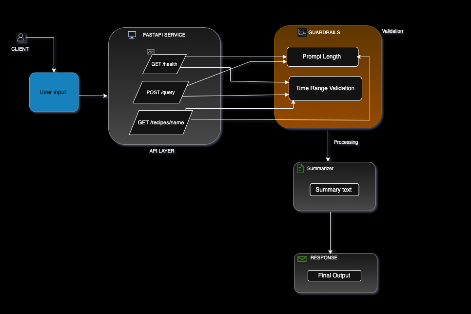
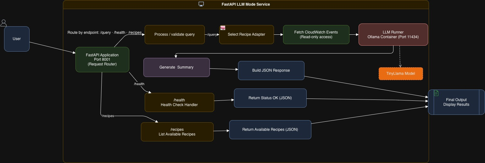
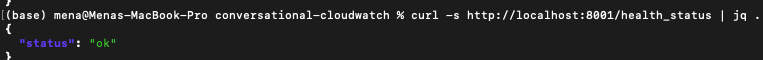
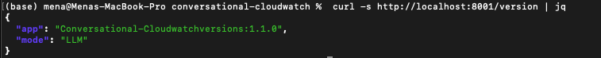
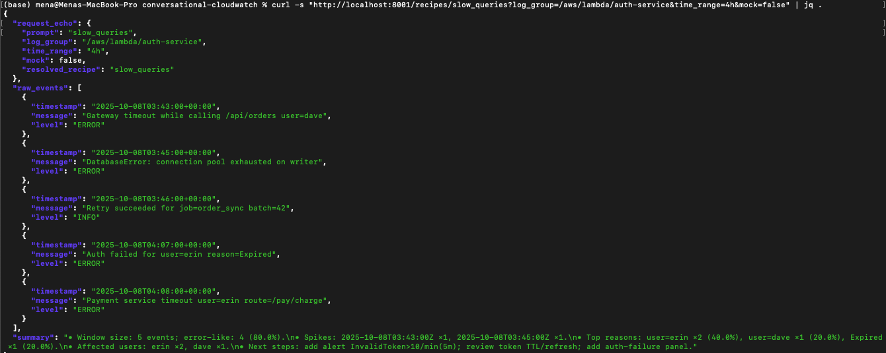

# Docker-based Model Runner for AWS CloudWatch Log Analysis


**Author:** Brian Murgor  
**Date:** October 9th 2025  

---

## (Concise Summary)

This project Convert plain-English questions into concise summaries over CloudWatch-style logs.

- Supports LocalStack and can connect to AWS CloudWatch (read-only)
- One-command setup via Docker Compose with pinned versions
- Exposes a single service on port 8001 with Swagger UI at /docs
- Endpoints: GET /health_status, GET /recipes, POST /query
- Designed for easy LLM integration and future AWS extensions
- Lightweight, fast, and suitable for both local development and production setups

---

## Table of Contents

1. [Problem & Context](#1-problem--context)  
2. [Solution Overview: Docker Model Runner Architecture for AWS CloudWatch](#2-solution-overview:docker-model-runner-architecture-for-aws-cloudwatch)
  2.1 [System Architecture (Figure 1)](#21-system-architecture-figure-1)  
  2.2 [Operating Modes](#22-operating-modes)  
  2.3 [Guardrails](#23-guardrails)
  2.4 [Intergration with AWS](#24-intergration-with-aws)
3. [API Endpoint Details](#3-api-endpoint-details)  
4. [Environment & Prerequisites](#4-environment--prerequisites)  
5. [Step-by-Step Implementation — **Main Diagram (Figure 2)**](#5-step-by-step-implementation--main-diagram-figure-2)  
6. [How to Reproduce](#6-how-to-reproduce)  
7. [Project Structure](#7-project-structure)
8. [AWS CLI Setup (Optional)](#8-aws-cli-setup-optional)  
9. [Testing and Results](#9-testing-and-results)  
10. [Result Table](#10-result-table)
11. [Evidence (Screenshots)](#11-evidence-screenshots)  
12. [Current Limitations & Planned Improvements](#12-current-limitations--planned-improvements)  
13. [IAM and Security Considerations](#13-iam-and-security-considerations)  
14. [Discussion](#14-discussion)   
15. [Conclusion](#15-conclusion)  
16. [References & Credits](#16-references--credits)  
17. [Appendix: Full Configs & Scripts](#17-appendix-full-configs--scripts)

---

## 1. Problem & Context

The modern cloud environment produces huge amounts of logs, and it is hard to find the critical issues within a short time. Although AWS CloudWatch offers strong monitoring and alert systems, the search of trends in error logs can be complicated with complex queries or the need to go through them manually.

To deal with this, we defined a Dockerized model runner which wraps the FastAPI + TinyLlama summarization stack, which allows conversational inferences out of logs in a way similar to local logging or local AWS CloudWatch logging.

---

### 1.1 Use Case: Querying AWS CloudWatch with Natural Language

- The primary use case is to shorten incident-response time by allowing an engineer to ask plain-English questions (e.g., "Did errors spike in the auth service in the last 2 hours?") and get a fast, summarized answer without writing complex CloudWatch syntax.

- To achieve this, the FastAPI application (running in its own Docker container) connects directly to AWS CloudWatch to fetch the raw logs. These logs are then sent to the local Docker model runner (Ollama) for analysis.

---
  
## 2. Solution Overview: Docker Model Runner Architecture for AWS CloudWatch

> **Update (v1.1.0):**  
> This version adds Guardrails AI validation for safe prompt and time-range handling, a `/version` endpoint for runtime introspection, and a startup health confirmation log:  
> `Health check OK — API responding normally (startup)`

The entire application is managed by Docker Compose, which acts as the Docker component runner. It orchestrates all the individual services (components) needed for the app to function.

The most critical component is the Docker model runner, which is the ollama service defined in the docker-compose.yml file. This container runs the TinyLlama large language model locally. This allows our FastAPI application to send it raw logs and receive natural-language summaries back, all without relying on an external, paid API.

The solution integrates a FastAPI backend with an Ollama-based model runner (TinyLlama). Users submit a query through Swagger UI or via POST API calls. Depending on environment settings, the system either returns deterministic summaries (mock mode) or real LLM outputs

### 2.1 System Architecture (Figure 1)
 


- Conversational CloudWatch v1.1.0 integrates FastAPI with Ollama’s TinyLlama model under Docker Compose.  
- The architecture separates validation, retrieval, and summarization steps for clarity and reliability.  
- Guardrails validation checks every request before reaching the summarizer, while Docker ensures both containers (`app` and `ollama`) start in a healthy state with isolated networking.

The diagram shows how the FastAPI container (port **8001**) interacts with the Ollama model runner (port **11434**).  
Requests arrive at `/health_status`, `/recipes`, or `/query`. Validations run before the summarizer (TinyLlama) produces structured JSON outputs.

### 2.2 Operating Modes
- **Deterministic (default):**  deterministic logs, perfect for demos/tests.  
- **LocalStack:** AWS-like local behavior for development.  
- **Real AWS:** connects to CloudWatch with least-privilege credentials (read-only).

### 2.3 Guardrails
- Limit prompts to 300 characters (prevent prompt injection).  
- Clamp time ranges between 5 minutes and 24 hours.  
- Limit response size for readability.  
- No secrets or PII in code; AWS access is read-only.

### 2.4 Intergration with AWS
The system will integrate smoothly with AWS CloudWatch in read-only access so that the developers can analyze and visualize the actual log data without altering the production systems. This can be simulated in development with LocalStack and secured access can be enforced in production with least-privilege IAM credentials.

This configuration gives teams the ability to have free movement of local testing environments to live monitoring in AWS without much reconfiguration.

To continue progressing with this integration, in the future, we will implement the interactions with the CloudWatch API directly using Boto3, as well as deploy the entire application as a containerized one on AWS ECS or Cloud Run to achieve the full-scale and fully production-ready performance.

---

## 3. API Endpoint Details

The API exposes three simple endpoints under  
**Base URL:** `http://localhost:8001`

### **GET /health_status**
Checks service status.  
**Response 200 OK**
```json
{"status":"ok"}

```
curl
```
curl -s http://localhost:8001/health_status
```

## **POST /query**
Runs a natural-language query over logs.

Request schema
```
{
  "prompt": "string (required)",
  "log_group": "string (optional)",
  "time_range": "string (optional)",
  "mock": "boolean (optional)"
}
```
Curl
```
curl -s -X POST http://localhost:8001/query \
 -H "Content-Type: application/json" \
 -d '{"prompt":"show error spikes last 2h","mock":true}'
```
## 4. Environment & Prerequisites
Test Environment
- macOS 14 / Windows 11
- Python 3.12+
- Docker 27 + Docker Compose v2.29
- Optional tools: LocalStack & AWS CLI
- Python dependancies
```
fastapi
uvicorn
httpx
pydantic
```
## 5. Step-by-Step Implementation — Main Diagram (Figure 2)

**Figure 2.**  



### What happens at fig2_system_diagram (Figure 2):

1. **Request Ingress**  
   - Requests arrive via `/health_status`, `/version`, `/recipes/{name}`, or `/query`.

2. **Guardrails Validation**  
   - Checks prompt length (≤ 300 chars) and time-range pattern (`^\d+[smhd]$`).  
   - Ensures `USE_LLM` and `mock` flags are properly configured.  
   - Invalid requests are rejected with clear error messages.

3. **Adapter Fetch**  
   - Loads deterministic data (`mock=true`) or realistic datasets (`mock=false`).  
   - Converts CloudWatch-like entries into structured log objects.

4. **Summarization**  
   - The summarizer identifies spikes, reasons, or affected users.  
   - If `USE_LLM=true`, it calls Ollama (TinyLlama) via port `11434` for natural summaries.  
   - Otherwise, deterministic summaries are generated locally.

5. **Response & Output**  
   - Returns structured JSON with fields:  
     - `request_echo`  
     - `raw_events`  
     - `summary`  
   - Logs a startup confirmation:  
     `INFO: Health check OK — API responding normally (startup)`


### Key Components (mapped to Figure 2)
- **FastAPI App (port 8001)** – routes, guardrails, and responses  
- **Adapters** – provide events (daterministic vs “realish”)  
- **Summarizer** – lightweight Python  creating structured insights  
- **Docker Compose** – orchestrates the app + (optional) model runner

### Reproduce 

### Reproduce Locally
The following commands rebuild and launch the stack, then verify key endpoints.

```bash
docker compose build

docker compose up -d

curl -s http://localhost:8001/health_status | jq .

curl -s "http://localhost:8001/recipes/error_spikes?log_group=/aws/lambda/auth-service&time_range=2h&mock=true"  | jq .

curl -s "http://localhost:8001/recipes/error_spikes?log_group=/aws/lambda/auth-service&time_range=2h&mock=false" | jq .

curl -s "http://localhost:8001/recipes/slow_queries?log_group=/aws/lambda/auth-service&time_range=4h&mock=false" | jq .
```

Run the stack:
```
docker compose up -d --build
```
- Docker ensures both containers start in order and remain healthy.

### 6. How to Reproduce

- 1. Clone the repo
```
git clone https://github.com/kubetoolsio/llm-foundations.git
cd conversational-cloudwatch
```


- 2. Start with Docker
```
docker compose up -d --build
```


- 3. Verify installation
```
curl -s http://localhost:8001/health_status
```
Expected: {"status":"ok"}

- 4. Test demo mode
```
curl -s -X POST http://localhost:8001/query \
-H "Content-Type: application/json" \
-d '{"prompt":"error spikes last 2h","mock":true}'
```

5. Test real LLM mode

- Set deterministic mode =false in .env
- Rebuild and rerun compose.
- Repeat the same query → LLM summary.

Explore Swagger UI at http://127.0.0.1:8001/docs

### 7. Project Structure
The directories below reflect the final working build used in testing and screenshots
```
conversational-cloudwatch/
│
├── app/                              # Core FastAPI application
│   ├── main.py                       # Main FastAPI app (defines routes: /health_status, /query, /recipes)
|   |──guardrails.py                  # validates inputs (prompt length , time range ) before summarization 
│   ├── adapters.py                   # Fetches logs (mock vs “realish” data)
│   ├── summarizer.py                 # Summarizes and analyzes log events
│   ├── mcp_client.py                 # (Optional) Placeholder for model client extensions
│   └── recipes/                      # Built-in log analysis “recipes”
│       ├── error_spikes.py           # Handles error spike summarization
│       └── slow_queries.py           
│       └── traffic_summary.py   
├── docs/                             # Documentation and presentation material
│   ├── BLOG_DRAFT.md                 # Full implementation report (this file)
│   ├── ARCHITECTURE.md               # System & data flow architecture explanation
│   ├── IAM_DRAFT.md                  # IAM policy draft and permissions rationale
│   ├── Screenshots/                  # Collected visual results for evidence
│   │   ├── health_status.png
│   │   ├── error_spikes_llm.png
│   │   ├── slow_queries.png
│   │   └── convocloud_architecture.png
│   └── fig2_runtime_flow.png         # Step-by-step runtime diagram (Figure 2)
│
├── .env                              # Environment configuration (e.g. deterministic=false, OLLAMA_MODEL)
├── .dockerignore                     # Exclude non-essential files from Docker builds
├── .gitignore                        # Ignore rules for git
├── Dockerfile                        # Container definition for FastAPI app
├── docker-compose.yml                # Orchestrates FastAPI app + Ollama model runner
├── requirements.txt                  # Python dependencies list
├── README.md                         # Setup guide and overview
└── AWSCLIV2.pkg                      # (Optional) AWS CLI installer for IAM/local testing
```

## 7.1 Why This Structure Works

- Modular design → independent recipes/adapters.
- Clear testing boundaries.
- Easy summarizer swap.
- Environment flexibility: Same code works with deterministic local sample logs, LocalStack, or real AWS.


## 8. AWS CLI Setup (Optional)

Install
```
# macOS
brew install awscli
# Linux
sudo apt install awscli
```

Windows: Download MSI from AWS site.

Configure
```
aws configure
```

Test
```
aws sts get-caller-identity
```

## Required IAM (read-only)

- Logs ReadOnlyAccess policy

- No PII or secrets stored

- Credentials handled via environment variables


## 09. Result Table

| Query Type              | Expected Output                         | Actual Result                          |
|-------------------------|-----------------------------------------|----------------                        |
| `/version`              | App metadata (version, mode, model)     | Returned *(Figure 10.2)*               |
| `docker containers`     | the containers up and running           | Running | *(Figure 10.3)*              |
| `/recipes/slow_queries` | Structured count + insights summary     | Real LLM summarization *(Figure 10.4)* |

### **Deployment Verification:**  
- Prior to testing endpoints, Figure 4 confirms both containers were running and healthy under Docker Compose orchestration.


## 10. Evidence (Screenshots)

**Figure 10.1** — Health Status: {"status":"ok"}


- Verifies that the API container is running and healthy with a `{"status":"ok"}` response.

**Figure 10.2** - Version Endpoint


- Displays `/version` endpoint response showing build `v1.1.0`, mode `LLM`, and model `TinyLlama`, confirming successful introspection.

### Figure 10.3 — Docker Containers Running


- Docker Desktop showing both services active and healthy:  
- `conversational-cloudwatch-app-1` (FastAPI backend) and `conversational-cloudwatch-ollama-1` (TinyLlama model runner), confirming proper Docker Compose orchestration.

**Figure 10.4.** Slow Queries Recipe

  
- Executed with `/recipes/slow_queries?mock=false`, showing real LLM summarization of database latency and timeout incidents.
- It identifies `Gateway timeout`, `DatabaseError`, and `Expired token` issues with next-step recommendations.


## 12. Current Limitations & Planned Improvements
**Current Limitations**
- Local sample / LocalStack logs only (currently); real AWS CloudWatch log ingestion is wired but still being validated end-to-end.
- Base recipe coverage only (slow_queries, error_spikes, traffic_summary)  
- IAM policy exists but not fully tested  
- Limited to `TinyLlama` model for summarization  

**Planned Improvements**
- Integrate with live AWS CloudWatch using Boto3 and expand model options
- Add additional recipes (security alerts, latency profiling)  
- Expand LLM model options for improved summarization accuracy  
- Deploy to Cloud Run for scalable public access

In the future, we plan to containerize the AWS data-fetching client (which we call the MCP server) into its own dedicated Docker application. This will improve scalability and better separate the data-fetching logic from the main API

## 13. IAM and Security Considerations
- When integrated with AWS, the system uses a least-privilege IAM policy (read-only).
- No secrets or PII are stored in containers.
- Sensitive configs reside in environment variables.

## 14. Discussion
- The modular architecture enables flexible deployment and consistent performance.
- Dockerization ensures environment parity.
- TinyLlama provides accurate summaries with low resource overhead.


## 15. Conclusion
This project demonstrates how conversational AI can ease CloudWatch log analysis with the help of FastAPI, Docker, and TinyLlama. Version 1.1.0 provides a safe and scalable base, guardrails, complete Docker orchestration, and recipes to expand log-analysis.

The system is scalable to AWS CloudWatch and extensions such as new models or alert recipes in the future making natural-language monitoring a bit closer to production.

## 16. References & Credits
- Amazon Web Services. (n.d.). Amazon CloudWatch Logs — User Guide. Retrieved from https://docs.aws.amazon.com/
- FastAPI. (n.d.). FastAPI documentation - Retrieved from https://fastapi.tiangolo.com/
- Docker. (n.d.). Docker documentation- Retrieved https://docs.docker.com/
- LocalStack. (n.d.). LocalStack documentation - Retrieved from https://docs.localstack.cloud/
- Uvicorn. (n.d.). Uvicorn documentation - Retrieved from https://www.uvicorn.org/
- Pydantic. (n.d.). Pydantic v2 documentation - Retrieved from https://docs.pydantic.dev/

## Licensing:
No PII or secrets used. All code/demo is shareable under referenced open-source licenses. 

## 17. Appendix: Full Configs & Scripts
**requirments.txt**
```
fastapi
uvicorn
httpx
pydantic
```

**.env**
```
OLLAMA_HOST=http://ollama:11434
OLLAMA_MODEL=tinyllama
MOCK=true
USE_LLM=true
LLM_TIMEOUT=120
LLM_NUM_PREDICT=12

PORT=8001
```
**docker-compose.yml**
```
sversion: "3.9"

services:
  app:
    build: .
    ports:
      - "${PORT:-8001}:8001"
    env_file:
      - .env
    depends_on:
      ollama:
        condition: service_started
    command: >
      uvicorn app.main:app --host 0.0.0.0 --port 8001 --reload
    restart: unless-stopped

  ollama:
    image: ollama/ollama:latest
    ports:
      - "11434:11434"
    volumes:
      - ollama:/root/.ollama
volumes:
  ollama: {}
    ```
  
